## Hello, world!

I'm **Yuezhiui** — I enjoy building **interactive games**, **intelligent AI workflows**, **browser automation**, and creative tools.

| 🎮 Educational games | 🤖 AI & automation | 🎬 Creative technology |
| :--- | :--- | :--- |
| Godot games, GDScript, learning experiences | Agent tools, MCP integrations, browser workflows | Generative filmmaking and media tools |

## Tools & technologies

**Favorite programming languages**

  
  
  
  
  

  
  
  
  
  

**Creative & game-development tools**

  
  

## Featured project

**[KilosGrammar](https://github.com/Yuezhiui/KilosGrammar)** — an educational grammar-game project built with Godot.

## GitHub snapshot

## Contribution trail

Watch the snake eat my real GitHub contributions!

<picture>
  <source media="(prefers-color-scheme: dark)" srcset="./assets/contribution-snake-dark.svg" />
  <source media="(prefers-color-scheme: light)" srcset="./assets/contribution-snake.svg" />
  
</picture>

Code × Play × AI · Profile graphics update automatically every day
